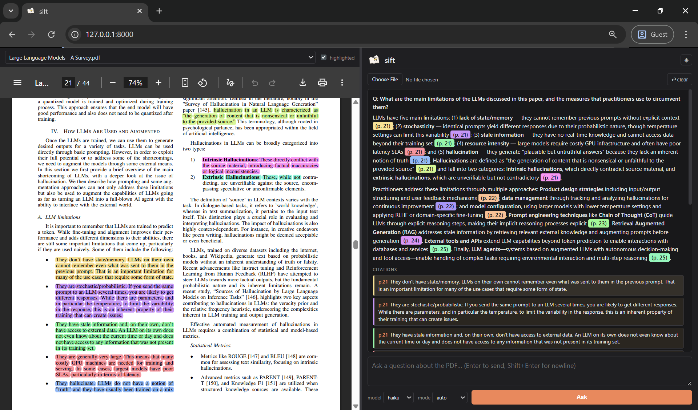

# sift

Ask questions about a PDF, get answers with **clickable, page-anchored
citations**, and see the source passages **highlighted** in a side-by-side
PDF viewer.

Pick any LLM you have a CLI for. **Claude, GPT-5, Gemini, Llama via
Ollama, anything on OpenRouter**, from a dropdown. Sift uses the
[Claude Agent SDK][sdk] as its agent runtime, and the SDK spawns whichever
CLI you select. Swapping providers means swapping a single dropdown
choice, not the code. The default backend is Anthropic's
[Claude Code][cc].

<p align="center">
  
</p>

## Features

- **Two-pane web UI**. PDF on the left, chat on the right.
- **Color-matched citations**. Each citation gets a distinct pastel
  color, applied to the PDF highlight, the citation chip's left border,
  and the inline `(p. N)` pill in the answer text. When several citations
  land on the same page, the colors tell you which highlight goes with
  which chip at a glance.
- **Click-to-jump**. Both inline `(p. 4)` references and the citation
  chips scroll the PDF to the right page on click.
- **Three answer modes**. Pick by how much initiative you want the model
  to take.
  - **`auto`** *(default)*. Concise, extractive, shaped to the question.
    Use when you're asking *about the paper*. Examples:
    *"What does the paper claim about X?"*,
    *"Which datasets did they evaluate on?"*,
    *"Summarize section 4."*
  - **`strict`**. Pure extraction, never infer or interpret. Use when you
    want the literal text only. Examples:
    *"List exactly the methods they evaluated."*,
    *"Quote the threats-to-validity section."*
  - **`freehand`**. The model is your collaborator and the user prompt is
    the spec. Inference, synthesis, application, and structural framing
    are encouraged. Every factual claim is still anchored to a citation,
    but inferences are marked ("suggests", "implies", "extending this").
    Use for anything generative. Examples:
    *"Fill this SLR rubric for me: [paste rubric]"*,
    *"Draft a related-work paragraph that critically engages with this paper."*,
    *"What hypotheses does the framework in §3 suggest about [my domain]?"*,
    *"Identify weaknesses in their evaluation."*

  Rule of thumb. **auto** for "tell me about the paper", **freehand** for
  "use the paper to do something for me", **strict** when you don't want
  the model adding any flavor.
- **Per-PDF chat memory**. Follow-up questions like "make that more
  concise" or "what did I ask first?" work because each turn sees the
  prior conversation. A clear button wipes history, and turns rehydrate when
  you switch back to a PDF.
- **Abstract is off-limits**. `extract_pages` wraps the abstract in
  explicit `[BEGIN ABSTRACT]` / `[END ABSTRACT]` markers and the prompt
  forbids citing inside them, forcing the model to anchor claims in the
  body where they're elaborated.
- **Markdown answers** with bold, lists, headings, and inline code.
- **Activity trail**. Collapsed `Thought for Ns · K steps` per turn
  shows the agent's reasoning and tool calls.
- **Robust word-coordinate highlighting**. Multi-line wraps, hyphenated
  breaks, and minor paraphrases all match. Cross-page fallback: if the
  cited page misses, every other page is scanned and the longest match
  wins, so off-by-one page numbers from the model self-heal.
- **Backend & model selector, any LLM with a Claude-Code-compatible CLI.**
  The default backend is Anthropic's `claude` CLI (Haiku, Sonnet, Opus).
  Install [OpenClaude](https://github.com/Gitlawb/openclaude) and you
  unlock GPT-5 / GPT-4o, Gemini 2 Pro & Flash, every model on OpenRouter,
  and local models via Ollama. Sift just spawns whichever CLI the
  dropdown selects, and provider auth lives inside the CLI itself, not in
  this repo. See [Switching backends](#switching-backends) for the recipe.
- **CLI**, same agent, headless:
  `python pdf_qa.py paper.pdf "question" [--backend openclaude] [--model …] [--mode auto|strict|freehand]`.

## Prerequisites

- **Python 3.10 or newer.** The Claude Agent SDK requires it. If
  `pip install` reports `No matching distribution found for
  claude-agent-sdk`, your Python is too old. Check with
  `python --version` and install a newer one
  ([python.org](https://www.python.org/downloads/)).
- **At least one supported CLI on your PATH.** Sift's Agent SDK spawns
  whatever CLI the backend dropdown picks. Install whichever provider
  you want to use.
  - **Claude Code** (default backend `claude`). [Install guide][cc].
    Sign in once interactively (`claude`). Works with a Claude Pro/Max
    subscription or an `ANTHROPIC_API_KEY`.
  - **OpenClaude** (backend `openclaude`). `npm install -g @gitlawb/openclaude`,
    then `openclaude` and `/provider` to authenticate against OpenAI,
    Gemini, OpenRouter, Ollama, GitHub Models, etc.

  Auth lives entirely inside the CLI you installed (e.g. `~/.claude/`,
  `~/.openclaude/`, `~/.codex/`). Sift never reads or stores credentials.
  Cloning the repo is enough. No `.env` files, no key configuration in
  this project.

## Setup

### macOS / Linux

```bash
git clone https://github.com/<you>/sift.git
cd sift

python3 -m venv venv
source venv/bin/activate
pip install -r requirements.txt
```

If `python3` resolves to an older interpreter, run the venv step with the
specific binary, e.g. `python3.12 -m venv venv`.

### Windows (PowerShell)

```powershell
git clone https://github.com/<you>/sift.git
cd sift

python -m venv venv
venv\Scripts\Activate.ps1
pip install -r requirements.txt
```

If PowerShell blocks the activate script with an execution-policy error,
run once: `Set-ExecutionPolicy -Scope CurrentUser RemoteSigned`.
Use `venv\Scripts\activate.bat` from cmd.exe instead of PowerShell.

## Run

### Web UI

```bash
uvicorn app:app --port 8000
```

Open http://localhost:8000. Upload a PDF, ask a question, click any
`(p. N)` reference or citation chip to jump.

### CLI

```bash
# default backend (Claude Code / Haiku)
python pdf_qa.py paper.pdf "What is the main contribution?"

# switch model
python pdf_qa.py --model sonnet --mode freehand paper.pdf "Limitations?"

# switch backend (uses whichever provider openclaude is configured for)
python pdf_qa.py --backend openclaude paper.pdf "Summarize section 3"
```

Outputs: `paper_highlighted.pdf` and `paper_citations.json` next to the
input PDF.

## How it works

1. PyMuPDF extracts per-page text into `<paper>.pages.txt`.
2. The agent reads that file, identifies passages that ground each claim,
   and writes a tiny script that calls
   `highlight_lib.highlight_pdf(input, output, citations, passages)`.
3. `highlight_lib` matches each passage at the **word-coordinate level**.
   It pulls every word's bounding box via `page.get_text("words")` and
   finds the longest contiguous matching run vs the quote, normalized
   lowercase + alphanumeric. Word-level matching survives anything
   `search_for` chokes on: line wraps, hyphenated breaks, ligatures.
4. Citations JSON records the **actual highlighted text** plus a per-citation
   pastel color, so the chip's border, the inline `(p. N)` pill, and the
   yellow PDF region always agree.
5. **Per-PDF chat memory** lives in an in-process dict (`CHATS`) keyed by
   filename. Each `/ask` prepends the last 10 turns to the prompt as a
   `PRIOR CONVERSATION` block, so the agent can answer follow-ups that
   reference earlier turns. Memory is volatile (lost on uvicorn restart),
   so add a JSON dump in `app.py` if you want persistence.

## Project layout

```
.
├── app.py             FastAPI server (web UI + SSE streaming)
├── agent_core.py      Shared agent setup and prompt for CLI + web
├── highlight_lib.py   Word-coordinate highlighting library
├── pdf_qa.py          CLI entrypoint
├── static/index.html  Two-pane UI (vanilla JS, no build step)
├── pdfs/              User PDFs and generated artifacts (gitignored)
└── requirements.txt
```

## Configuration

Endpoints (`app.py`).

- `GET  /`                  static UI
- `GET  /config`            model + mode choices
- `POST /upload`            multipart PDF upload
- `GET  /pdfs`              list uploaded PDFs
- `GET  /pdf/{id}`          serve PDF (`?highlighted=true` for annotated copy)
- `GET  /history/{id}`      per-PDF chat history for rehydration on reload
- `POST /clear/{id}`        wipe chat history for a PDF
- `POST /ask`               SSE stream: `stats`, `text`, `tool`, `done`, `error`

Per-turn options sent to `/ask`:
`{ file_id, question, model, mode: "auto|strict|freehand", backend: "claude|openclaude|…" }`.

`model` is whatever alias the chosen `backend` understands. The legal
set is reported per-backend by `GET /config` and the UI's dropdown
adapts accordingly. The defaults (`DEFAULT_BACKEND`, `DEFAULT_MODEL`,
`DEFAULT_MODE`) and per-PDF turn cap (`MAX_TURNS_KEPT`) live in
`agent_core.py` and `app.py`.

## Switching backends

The Claude Agent SDK is the stable middle of sift. **Which CLI it
spawns** is the swappable piece, and that CLI determines which LLM
provider sift talks to.

```
┌──────────────────────────────────────────────────────────────┐
│  sift  (this repo)                                           │
└─────────────────────────────┬────────────────────────────────┘
                              │ uses
                              ▼
┌──────────────────────────────────────────────────────────────┐
│  claude_agent_sdk  (Anthropic's Python package)              │
│   agent loop, streaming, tool dispatch, cost reporting       │
└─────────────────────────────┬────────────────────────────────┘
                              │ spawns subprocess (stream-json)
                              ▼
                  ┌───────────┴───────────┐
                  │                       │
                  ▼                       ▼
            ┌──────────┐           ┌────────────┐
            │  claude  │           │ openclaude │   ← swap here
            │ (default)│           │            │
            └────┬─────┘           └─────┬──────┘
                 │                       │
                 ▼                       ▼
      api.anthropic.com         OpenAI / Gemini /
       (Claude models)          OpenRouter / Ollama / …
```

Every sift feature works the same across backends. Citation chips,
color-matched highlights, section detection, abstract guard, the modes,
the chat memory, cost reporting. The only per-backend differences are
*which model names are valid* and *whose account gets billed*.

### Backends shipped today

| Backend | Install | Models available | Provider auth lives in |
|---|---|---|---|
| `claude` *(default)* | [Claude Code][cc] (one-time `claude` sign-in) | `haiku`, `sonnet`, `opus` (and any other alias Claude Code accepts via `inherit`) | `~/.claude/` |
| `openclaude` | `npm install -g @gitlawb/openclaude`, then `openclaude` and `/provider` | Whatever your chosen provider exposes. GPT-5, Gemini, OpenRouter's 200+, local Ollama models | `~/.openclaude/`, `~/.codex/` |

### Adding a third backend

Add one entry to `BACKENDS` in `agent_core.py`.

```python
BACKENDS["yourcli"] = {
    "display": "Your CLI (which provider)",
    "binary": "yourcli",                  # name on PATH, or None for SDK discovery
    "models": ["inherit", "model-a", "model-b"],
    "default_model": "inherit",
}
```

The dropdown picks it up automatically and the SDK spawns the binary.
No other code changes.

### One caveat

Sift relies on the SDK's stream-json transport
(`--output-format stream-json --verbose`). Claude Code defines that
schema. OpenClaude is verified protocol-compatible (we tested it
end-to-end). If you plug in *another* CLI and it emits a different
JSON shape for assistant / tool / result messages, sift will fail with
a parse error. That's a protocol-mismatch bug in the alternative CLI,
not in sift. Debugging steps live in `subprocess_cli.py` of the Agent
SDK package.

## Notes

- `max_buffer_size` is set to 20 MB on the SDK transport because the `Read`
  tool returns large JSON payloads when invoked on big files. Don't lower it.
- The `Read` tool is intentionally pointed at the extracted `.pages.txt`,
  never at the PDF directly. Invoking `Read` on a PDF returns each page as
  base64 image data and immediately blows past any sane buffer.

[sdk]: https://github.com/anthropics/claude-agent-sdk-python
[pymupdf]: https://pymupdf.io/
[cc]: https://docs.claude.com/en/docs/claude-code
